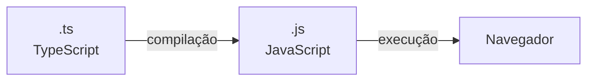
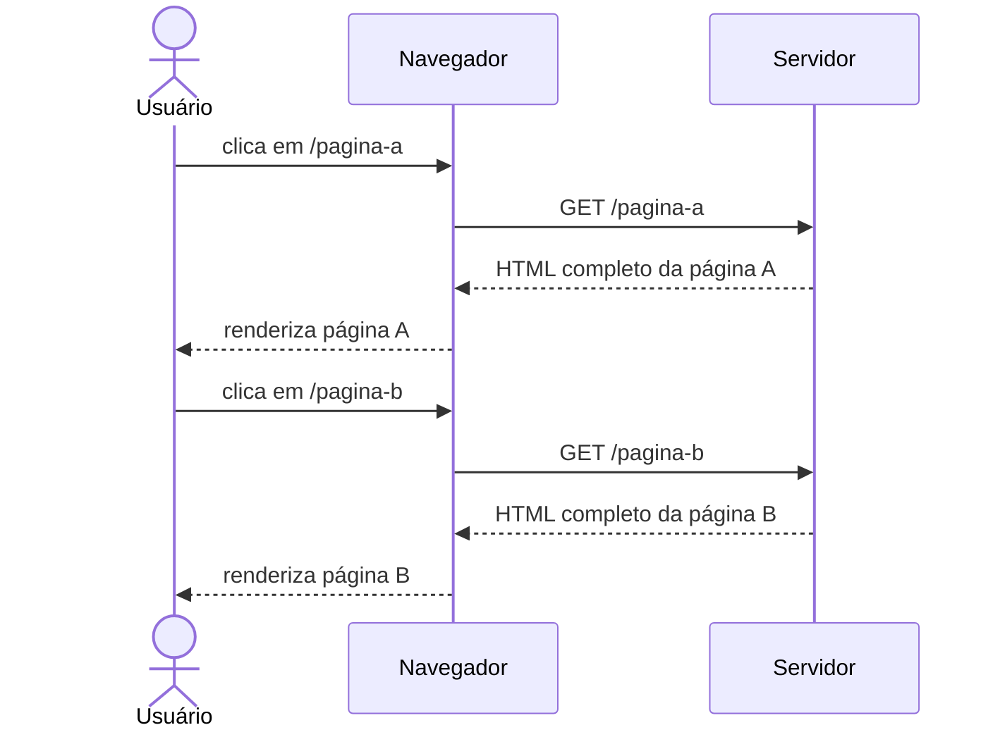
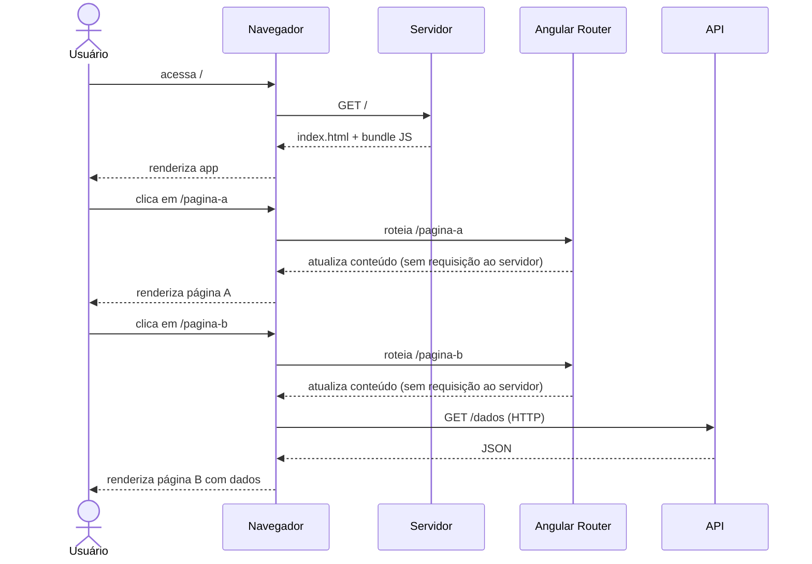
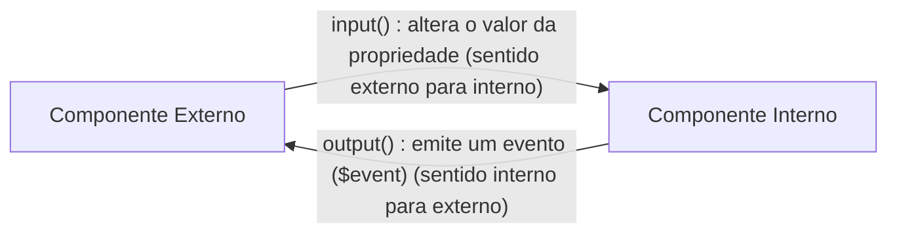
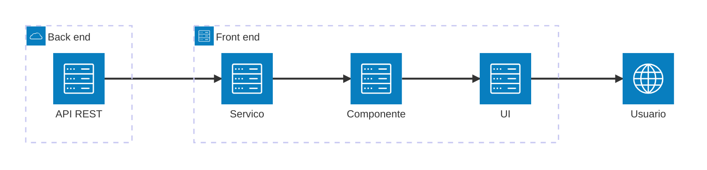
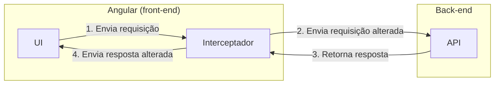

# Frameworks Front-end

Este texto reúne o conteúdo da disciplina Frameworks Front-end. Parte dos fundamentos de frameworks JavaScript e do TypeScript, apresenta o Angular como framework para construção de aplicações front-end, abordando sua CLI, estrutura de projetos, componentes, roteamento, templates e comunicação com aplicações back-end por meio do protocolo HTTP. Para uma abordagem prática, consulte o [Tutorial](./TUTORIAL.md).

## Introdução

A construção de interfaces modernas para aplicações web exige muito mais do que HTML e CSS estáticos. À medida que as aplicações ficam mais complexas, manipular o DOM diretamente com JavaScript puro se torna uma tarefa difícil de manter. Frameworks front-end surgiram para resolver esse problema, oferecendo modelos declarativos de construção de interfaces, organização em componentes reutilizáveis e ferramentas de desenvolvimento integradas. O TypeScript, linguagem que amplia o JavaScript com verificação estática de tipos, é um ponto de destaque nessa abordagem e fundamenta o funcionamento do Angular.

### Frameworks front-end

Construir páginas interativas com JavaScript puro consiste sobretudo em manipular o DOM por meio de métodos como `createElement`, `appendChild` e similares. Considere uma lista de usuários retornada por uma API. Para exibi-la na página, seria necessário algo como:

```javascript
function exibirUsuarios(usuarios) {
  const tabela = document.getElementById('tabela-usuarios');

  // limpar conteúdo anterior antes de reexibir
  while (tabela.firstChild) {
    tabela.removeChild(tabela.firstChild);
  }

  usuarios.forEach(usuario => {
    const linha = document.createElement('tr');

    const colunaId = document.createElement('td');
    colunaId.textContent = usuario.id;
    linha.appendChild(colunaId);

    const colunaNome = document.createElement('td');
    colunaNome.textContent = usuario.nome;
    linha.appendChild(colunaNome);

    const colunaAcoes = document.createElement('td');
    const btnRemover = document.createElement('button');
    btnRemover.textContent = 'Remover';
    btnRemover.addEventListener('click', () => remover(usuario.id));
    colunaAcoes.appendChild(btnRemover);
    linha.appendChild(colunaAcoes);

    tabela.appendChild(linha);
  });
}
```

Esse código apenas renderiza uma lista. Qualquer alteração nos dados (adicionar, remover ou editar um item) exige chamar `exibirUsuarios()` novamente ou manipular o DOM manualmente para refletir a mudança. Em uma aplicação com vários componentes interdependentes e estado compartilhado, esse volume de código cresce rapidamente e se torna difícil de manter.

Frameworks front-end resolvem esse problema. Em geral, frameworks front-end são sinônimo de frameworks JavaScript, a linguagem amplamente suportada pelos navegadores para adicionar interatividade à criação de interfaces de usuário. Alguns, como o Angular, adotam TypeScript, mas o princípio é o mesmo. Esses frameworks oferecem principalmente:

- **Modo declarativo de construção de interfaces**: em vez de descrever *como* atualizar o DOM passo a passo, o desenvolvedor descreve *como a interface deve parecer* dado um determinado estado, e o framework se encarrega das atualizações.
- **Conjunto de ferramentas de desenvolvimento**: suporte a compilação, testes, geração de código, etc.
- **Organização em componentes e módulos reutilizáveis**: a interface é dividida em partes independentes que encapsulam template, lógica e estilo.
- **Roteamento no lado cliente**: a navegação entre diferentes visualizações ocorre sem requisições completas ao servidor, atualizando apenas o conteúdo da página por meio de requisições assíncronas e manipulação do DOM. Essa abordagem, denominada *Single Page Application* (SPA), gera URLs distintas para cada visualização, proporcionando uma experiência de navegação semelhante à de uma aplicação com múltiplas páginas.

> [!TIP]
> Para saber mais sobre SPAs: <https://developer.mozilla.org/en-US/docs/Glossary/SPA>

### Introdução ao TypeScript

TypeScript é uma linguagem de programação desenvolvida pela Microsoft que pode ser considerada um *superset* do JavaScript: acrescenta funcionalidades ao JavaScript, mas a maior parte de um código JavaScript válido também é código TypeScript válido.

No processo de compilação, o código TypeScript é convertido para JavaScript. O código que executa no navegador continua sendo JavaScript, portanto não há problemas de compatibilidade:



Por exemplo, o seguinte código TypeScript:

```typescript
let nome: string = "WebAcademy";
```

É compilado para JavaScript equivalente, sem as anotações de tipo:

```javascript
let nome = "WebAcademy";
```

A principal adição do TypeScript é a **verificação de tipos** (análise estática):

```text
TypeScript = JavaScript + Verificação de tipos
```

### Definição de tipos

O JavaScript infere tipos em tempo de execução. O TypeScript permite a definição explícita de tipos, detectando inconsistências em tempo de compilação:

```typescript
let stringA = "WebAcademy";         // inferência de tipo
let stringB: string = "WebAcademy"; // tipo explícito
// stringA e stringB são do mesmo tipo
```

Ao tentar atribuir um valor de tipo incompatível, o TypeScript reporta um erro em tempo de compilação:

```typescript
class Usuario {
  id: number | undefined;
  nome: string | undefined;
}

// válido
const usuarioA: Usuario = {
  id: 1,
  nome: "Daniel"
};

// inválido
const usuarioB: Usuario = {
  id: 1,
  nome: 10  // Erro: Type 'number' is not assignable to type 'string'
};
```

Tipos também podem ser definidos com `interface` ou `type`:

```typescript
interface Usuario {
  id: number;
  nome: string;
}

type Usuario = {
  id: number;
  nome: string;
}
```

A sintaxe é similar, mas existem diferenças importantes. A principal é que interfaces são **abertas** e types são **fechados**: uma interface pode ser redeclarada em qualquer parte do código e o TypeScript fará a fusão das declarações automaticamente (*declaration merging*), o que pode gerar comportamento imprevisível em projetos grandes. Um type com o mesmo nome simplesmente gera erro de compilação, tornando o código mais previsível.

> [!TIP]
> Referências: [Differences between Type Aliases and Interfaces](https://www.typescriptlang.org/docs/handbook/2/everyday-types.html#differences-between-type-aliases-and-interfaces) | [Why I use Type and not Interface in TypeScript](https://www.youtube.com/watch?v=Idf0zh9f3qQ)

## Fundamentos do Angular

Angular é um framework front-end mantido pelo Google que adota TypeScript como linguagem principal e oferece um conjunto completo de ferramentas para o desenvolvimento de aplicações web robustas e escaláveis. Seu ecossistema cobre desde a instalação e configuração da CLI até a criação de projetos, a organização de espaços de trabalho e a execução da aplicação em ambientes de desenvolvimento e produção.

### O que é o Angular?

Angular é um framework criado pelo Google, baseado em TypeScript, que fornece um ambiente de desenvolvimento que inclui:

- Uma estrutura baseada em **componentes**, que facilita a escalabilidade da aplicação.
- Uma coleção de **bibliotecas integradas** que cobrem roteamento, gerenciamento de formulários, comunicação cliente-servidor, entre outros.
- Um conjunto de **ferramentas** para construção, teste e atualização do código.

O framework adota uma abordagem *opinionated*: em vez de oferecer infinitas opções de configuração, estabelece convenções e padrões por padrão, reduzindo a complexidade e acelerando o desenvolvimento. Isso contrasta com bibliotecas como o React, que são mais flexíveis mas exigem mais decisões arquiteturais do desenvolvedor.

O **AngularJS** (2010) foi o framework JavaScript original do Google para construção de aplicações web. Tratava tudo como diretiva, o que com o tempo se mostrou uma limitação para a componentização de aplicações maiores. Em 2016, o Google lançou o **Angular** (versão 2) como uma reescrita completa em TypeScript, com uma arquitetura baseada em componentes, tipagem estática e conjunto moderno de ferramentas.

> [!TIP]
> Documentação oficial: <https://v21.angular.dev/overview>

### Angular CLI

A Angular CLI (*Command Line Interface*) é a ferramenta principal para criar e manter aplicações Angular. Pode ser instalado via npm e fornece o comando `ng`, ponto de entrada para todas as operações do ciclo de desenvolvimento: criação de projetos, geração de código, execução, testes e build para produção.

```bash
npm install -g @angular/cli@21
```

A CLI não é apenas um atalho para tarefas manuais, pois garante que os arquivos gerados seguem as convenções do Angular, reduzindo erros de configuração e mantendo a consistência do projeto. Principais comandos:

| Comando | Descrição |
| --- | --- |
| `ng new <nome>` | Cria um novo espaço de trabalho |
| `ng serve` | Compila e serve a aplicação, recompilando automaticamente a cada alteração |
| `ng build` | Compila a aplicação para o diretório `dist/` |
| `ng generate` | Gera ou modifica arquivos (componentes, serviços, classes, etc.) |

> [!TIP]
> Referência completa dos comandos: <https://v21.angular.dev/cli>

### Espaços de trabalho

Um espaço de trabalho (*workspace*) é o contexto onde as aplicações Angular são desenvolvidas. Ele agrupa os arquivos de configuração globais, as dependências e um ou mais projetos. Ao executar `ng new`, a CLI cria o espaço de trabalho com uma aplicação inicial já configurada:

```bash
ng new <nome-app> --skip-git --defaults
```

O flag `--skip-git` omite a inicialização do repositório Git (útil quando o projeto já está em um repositório existente) e `--defaults` aceita todas as opções padrão sem perguntas interativas.

Um mesmo espaço de trabalho pode conter múltiplas aplicações.

> [!TIP]
> Referência: <https://v21.angular.dev/cli/new>

> [!TIP]
> Um mesmo espaço de trabalho pode conter múltiplos projetos (aplicações e bibliotecas), o que é útil para compartilhar código entre aplicações ou organizar monorepos. Referência: <https://v21.angular.dev/reference/configs/file-structure#multiple-projects>

### Estrutura do projeto

**Arquivos de configuração do espaço de trabalho:**

| Arquivo/Diretório | Descrição |
| --- | --- |
| `angular.json` | Configurações do Angular CLI para todos os projetos do espaço de trabalho, incluindo localização de arquivos CSS e JavaScript. |
| `package.json` | Configuração de pacotes npm disponíveis para todos os projetos, incluindo scripts NPM (start, build, etc.). |
| `tsconfig.json` | Configuração base do TypeScript. A presença deste arquivo indica que o diretório é a raiz de um projeto TypeScript. |
| `node_modules/` | Pacotes npm instalados para o espaço de trabalho. |
| `src/` | Código-fonte do projeto. |
| `public/` | Arquivos estáticos (imagens, etc.). Padrão a partir da versão 18, substituindo o `src/assets`. |

**Arquivos da aplicação (`src/`):**

| Arquivo/Diretório | Descrição |
| --- | --- |
| `index.html` | Página HTML principal. Arquivos JavaScript e CSS são adicionados automaticamente no processo de build. |
| `main.ts` | Ponto de entrada da aplicação. Inicializa o componente principal (`AppComponent`) no navegador. |
| `styles.css` | Estilos CSS globais do projeto. |
| `app/` | Contém a lógica e os dados do projeto: componentes, templates e estilos. |

**Arquivos do componente principal (`src/app/`):**

| Arquivo | Descrição |
| --- | --- |
| `app.ts` | Lógica do componente principal (`App`). |
| `app.html` | Template HTML do `App`. |
| `app.css` | Estilos CSS do `App`. |
| `app.spec.ts` | Arquivo de testes de unidade do `App`. |
| `app.routes.ts` | Configurações de roteamento da aplicação. |
| `app.config.ts` | Configurações gerais da aplicação, incluindo o fornecimento das rotas. |

### Executando o projeto

```bash
ng serve
```

A aplicação fica disponível em `http://localhost:4200/`. Sempre que um arquivo for alterado, o projeto é recompilado e a modificação é refletida automaticamente no cliente. Esse mecanismo é chamado de *live reload*.

O `ng serve` compila a aplicação em memória (não gera arquivos em `dist/`) e inicia um servidor de desenvolvimento. É possível alterar a porta padrão com o flag `--port`:

```bash
ng serve --port 4201
```

### Deploy

O servidor de aplicação do Angular ([vite](https://vite.dev/guide/)) não é recomendado para o modo de produção. Para um *deploy* simples são suficientes os seguintes passos:

1. Compilar o projeto: `ng build`
2. Copiar o conteúdo de `dist/<nome-app>/browser` para o servidor.
3. Configurar o servidor para redirecionar requisições de arquivos ausentes para `index.html`.

O terceiro passo é opcional, mas recomendado para garantir que o roteamento no lado cliente funcione corretamente. Sem ele, ao acessar uma URL diretamente (ex: `http://meuapp.com/agenda-list`), o servidor tentará encontrar um arquivo correspondente e retornará 404 se não existir. Com o redirecionamento, o servidor entrega `index.html` para todas as URLs, permitindo que o Angular Router gerencie a navegação. Isso ocorre porque, em uma SPA, o servidor entrega uma única página HTML e o JavaScript do Angular é responsável por renderizar o conteúdo correto com base na URL. Para saber mais sobre como configurar o servidor para isso, consulte a documentação em <https://v21.angular.dev/tools/cli/deployment#routed-apps-must-fall-back-to-indexhtml>.

> [!TIP]
> Referência: <https://v21.angular.dev/tools/cli/deployment>

## Componentes

Componentes são a unidade fundamental de qualquer aplicação Angular. Cada componente encapsula um fragmento da interface do usuário, composto por um template HTML, uma classe TypeScript com a lógica e estilos CSS próprios, formando blocos independentes e reutilizáveis que podem ser combinados para construir interfaces complexas. O sistema de roteamento do Angular, também coberto aqui, permite associar componentes a URLs e gerenciar a navegação em uma SPA.

### Visão geral

Componentes são os principais elementos na construção de aplicações Angular. Cada componente consiste em:

- Um **template HTML** que declara o que é renderizado na página.
- Uma **classe TypeScript** que define o comportamento do componente.
- Um **seletor CSS** que define como o componente é referenciado em outros templates.
- (Opcional) **Estilos CSS** aplicados ao template.

O componente `App` (seletor `app-root`) é o componente principal da aplicação, sendo o primeiro a ser renderizado. Ele é referenciado na função `bootstrapApplication()` do arquivo `main.ts`.

```typescript
import { bootstrapApplication } from '@angular/platform-browser';
import { appConfig } from './app/app.config';
import { App } from './app/app';

bootstrapApplication(App, appConfig)
  .catch((err) => console.error(err));
```

Estrutura de um componente:

```typescript
import { Component, signal } from '@angular/core';
import { RouterOutlet } from '@angular/router';

@Component({
  selector: 'app-root',
  imports: [RouterOutlet],
  templateUrl: './app.html',
  styleUrl: './app.css'
})
export class App {
  protected readonly title = signal('sgcmapp');
}
```

É importante destacar a relação entre o template e a classe do componente. O template é responsável por declarar a estrutura visual e os elementos HTML, enquanto a classe define as propriedades e métodos que controlam o comportamento do componente. O Angular estabelece uma ligação entre eles, permitindo que o template acesse as propriedades e métodos da classe para renderizar dinamicamente o conteúdo e responder a eventos. Isto é, a classe do compoente controla o estado e a lógica, enquanto o template é a representação visual desse estado.

Por padrão, um componente Angular separa claramente a lógica da apresentação em arquivos distintos: `.ts` para a classe, `.html` para o template e `.css` para os estilos. Essa é uma das diferenças mais marcantes em relação a frameworks como o React, onde a lógica e a apresentação são frequentemente combinadas em um único arquivo (JSX), ou o Vue, que também permite a combinação em arquivos `.vue`, mas com clara separação em blocos entre template, código JavaScript e estilos CSS. O Angular, por outro lado, adota uma abordagem mais tradicional de separação de preocupações, o que pode facilitar a organização e manutenção do código em projetos maiores.

No entanto, o Angular também suporta a definição de templates e estilos inline, permitindo que toda a definição do componente seja mantida em um único arquivo `.ts`. Isso pode ser útil para componentes muito simples, onde a quantidade de código é pequena e não justifica a criação de arquivos separados. Para isso, basta usar as propriedades `template` e `styles` no decorador `@Component`:

```typescript
@Component({
  selector: 'app-root',
  template: `<h1>{{ title() }}</h1>`,
  styles: [`
    h1 {
      color: blue;
    }
  `]
})
export class App {
  protected readonly title = signal('sgcmapp');
}
```

Desta forma, a classe TypeScript acaba sendo o elemento mais importante na definição do componente. Mas a escolha entre arquivos separados ou definição inline não tem impacto na funcionalidade do componente, sendo uma questão de preferência e organização do código.

### Criação de componentes

Novos componentes são gerados pelo Angular CLI:

```bash
ng generate component <nome-componente>
```

Por padrão, o seguinte conteúdo é gerado:

- Uma pasta com o nome do componente.
- Um arquivo de componente.
- Um arquivo de template. *(--inline-template impede criação)*
- Um arquivo CSS. *(--inline-style impede criação)*
- Um arquivo de especificação de teste. *(--skip-tests impede criação)*

Como mencionado anteriormente, é possível omitir a criação dos arquivos opcionais na geração do componente, mas a classe TypeScript do componente é sempre criada.

### Rotas

Em SPAs, é necessário controlar a navegação entre as diferentes visualizações da aplicação. As rotas associam caminhos de URL a componentes, de forma que o Angular Router saiba qual componente renderizar para cada URL. Elas são definidas no arquivo `app.routes.ts` como um array do tipo `Routes`:

```typescript
import { Routes } from '@angular/router';
import { AgendaList } from './paginas/atendimento/agenda-list/agenda-list';
import { AgendaForm } from './paginas/atendimento/agenda-form/agenda-form';

export const routes: Routes = [
  { path: 'agenda-list', component: AgendaList },
  { path: 'agenda-form', component: AgendaForm },
  { path: '**', redirectTo: '' }
];
```

A rota `**` é um curinga que captura qualquer caminho não mapeado, sendo usada aqui para redirecionar para a raiz da aplicação. O objeto `routes` é carregado no `app.config.ts` por meio da função `provideRouter()`:

```typescript
import { routes } from './app.routes';

export const appConfig: ApplicationConfig = {
  providers: [
    provideRouter(routes),
  ],
};
```

Para renderizar o componente correspondente à rota ativa, usa-se o elemento `<router-outlet>` no template. É nele que o Angular injeta o componente da rota atual:

```html
<!-- app.html -->
<main>
  <router-outlet></router-outlet>
</main>
```

Para navegação interna sem recarregar a página, usa-se a diretiva `routerLink` em vez do atributo `href`. Com `href`, o navegador faria uma requisição HTTP ao servidor e recarregaria a página por completo. Com `routerLink`, o Angular Router intercepta o clique, atualiza a URL e renderiza o componente correspondente sem sair da SPA:

```html
<a routerLink="/agenda-list">Agenda</a>
```

O componente `RouterLink` precisa ser importado na classe do componente que usa a diretiva:

```typescript
@Component({
  imports: [RouterOutlet, RouterLink],
  ...
})
```

Para rotas com parâmetros de consulta (útil para edição de registros):

```html
<a [routerLink]="'/agenda-form'" [queryParams]="{ id: item.id }">Editar</a>
```

Para ler esses parâmetros no componente de destino:

```typescript
private rota = inject(ActivatedRoute);

ngOnInit(): void {
  const id = this.rota.snapshot.queryParamMap.get('id');
  if (id) {
    this.servico.consultarPorId(+id).subscribe({ ... });
  }
}
```

### Roteamento no servidor e no cliente

Para entender o papel do Angular Router e da diretiva `routerLink`, é útil comparar as duas abordagens de roteamento em aplicações web.

Na abordagem tradicional, cada URL corresponde a uma requisição ao servidor, que responde com uma nova página HTML completa. Nesse modelo, a aplicação é uma coleção de páginas HTML distintas.



No roteamento no lado cliente (*Single Page Application*, SPA), o servidor entrega uma única página HTML. A navegação subsequente é controlada pelo JavaScript: o conteúdo é atualizado dinamicamente, sem recarregar a página. As diferentes visualizações recebem URLs distintas, proporcionando uma experiência semelhante à de uma aplicação com múltiplas páginas, mas sem as requisições completas ao servidor a cada navegação.



Vale destacar que, embora a navegação entre visualizações não gere novas requisições ao servidor, a aplicação ainda pode realizar requisições HTTP para carregar dados dinâmicos de uma API. Nesse caso, o servidor retorna dados em formato JSON (ou outro formato qualquer), e o Angular atualiza apenas a parte da interface que depende desses dados, sem recarregar a página.

## Templates

Um template Angular é uma parte de HTML com sintaxe adicional que permite integrar dinamicamente dados e comportamentos do componente. Essa associação direta entre o template e seu componente facilita a modularização da interface: em vez de trabalhar com arquivos HTML monolíticos e complexos, a aplicação é dividida em blocos de código menores, independentes e reutilizáveis, simplificando a manutenção e a legibilidade do projeto.

Fornece uma série de recursos:

- Mostrar ***strings* geradas dinamicamente** (interpolação de texto).
- Transformação de dados com os ***pipes***.
- **Atribuir eventos** para elementos HTML.
- **Alterar propriedades** dos elementos HTML dinamicamente (uni e bidirecional).
- **Variáveis** de template.
- **Fluxo de controle** para estruturas condicionais e de repetição.

### Interpolação de texto

A interpolação permite exibir dados dinâmicos no template HTML, sendo utilizada principalmente para mostrar ***strings* geradas dinamicamente**. Tudo entre `{{ }}` é avaliado pelo Angular como uma expressão (como variáveis ou métodos da classe do componente) e exibido como texto no HTML:

```typescript
// app.ts
protected readonly title = signal('SGCM');
```

```html
<!-- app.html -->
<span>{{ title() }}</span>
```

### Pipes

*Pipes* são recursos utilizados nos templates para formatar e transformar dados antes de exibi-los na tela, sem alterar o valor original na classe do componente. Eles são aplicados usando o caractere barra vertical (`|`).

Por exemplo, para formatar uma data para o padrão nacional ou transformar um texto em letras maiúsculas:

```html
<!-- Formatando uma data -->
<td>{{ item.data | date: 'dd/MM/yyyy' }}</td>

<!-- Transformando texto em maiúsculas -->
<span>{{ item.nome | uppercase }}</span>
```

> [!TIP]
> Referência: <https://v21.angular.dev/guide/templates/pipes>

### Atribuição de eventos

A atribuição de eventos (ou *event binding*) permite que a aplicação responda a ações do usuário no template (como cliques, digitação ou submissões). Para associar um evento a um método ou expressão na classe do componente, envolvemos o nome do evento entre parênteses `(nomeDoEvento)`:

```html
<a (click)="remover(item.id)">Remover</a>
```

O método `remover()` deve ser declarado na classe TypeScript do componente.

> [!TIP]
> Referência: <https://v21.angular.dev/guide/templates/event-listeners>

### Alterar propriedades

A atribuição de valores dinâmicos para propriedades de elementos HTML pode ser unidirecional ou bidirecional, onde além atribuir valor à propriedade, é possível associar a um evento que atualiza valores de objetos compartilhados (por exemplo, um modelo que representa um usuário).

Para atribuir valores dinâmicos a propriedades de elementos HTML (fluxo unidirecional: componente → template), usa-se `[]`:

```html
<input type="submit" value="Salvar" [disabled]="form.invalid">
```

Para two-way binding (fluxo bidirecional), que combina binding de propriedade com atribuição de evento, usa-se `[()]`:

```html
<input type="date" name="data" [(ngModel)]="registro.data">
```

O two-way binding atualiza a propriedade do objeto no componente sempre que o valor do campo muda, e vice-versa.

> [!TIP]
> Referências: <https://v21.angular.dev/guide/templates/binding> | <https://v21.angular.dev/guide/templates/two-way-binding>

### Variáveis de template

As variáveis de template ajudam a identificar um elemento em qualquer parte do template, sendo sempre declaradas com o caractere `#`:

```html
<form #form="ngForm">
  <input type="submit" value="Salvar" [disabled]="form.invalid">
</form>
```

A variável `form` dá acesso ao objeto `NgForm`, permitindo consultar o estado do formulário (ex: `form.valid`, `form.invalid`).

A partir do Angular 18, também é possível declarar variáveis locais diretamente no template com a diretiva `@let`. Elas servem para armazenar o resultado de expressões (como cálculos ou dados resolvidos por um pipe `async`) para reutilização no template:

```html
@let dobro = item.preco * 2;
<span>Preço duplicado: {{ dobro }}</span>
```

> [!TIP]
> Referência: <https://v21.angular.dev/guide/templates/variables>

### Fluxo de controle

O fluxo de controle permite exibir condicionalmente ou repetir elementos diretamente no template. Esse recurso foi introduzido no Angular 17 em substituição às antigas diretivas estruturais (`*ngIf` e `*ngFor`).

Para exibições condicionais, utilizamos a estrutura `@if` / `@else`:

```html
@if (registros.length > 0) {
  <span>Total de registros: {{ registros.length }}</span>
} @else {
  <span>Nenhum registro encontrado</span>
}
```

Para repetir elementos em uma lista, utilizamos o `@for`. Ele exige a instrução `track` para definir uma propriedade única (como um ID), ajudando o Angular a otimizar a renderização. Podemos também incluir um bloco `@empty` para tratar o caso de a lista estar vazia:

```html
<tbody>
  @for (item of registros; track item.id) {
    <tr>
      <td>{{ item.data | date: 'dd/MM/yyyy' }}</td>
      <td>{{ item.hora }}</td>
      <td>{{ item.paciente.nome }}</td>
    </tr>
  } @empty {
    <tr>
      <td colspan="3">Nenhum registro encontrado</td>
    </tr>
  }
</tbody>
```

> [!TIP]
> Referência: <https://v21.angular.dev/guide/templates/control-flow>

### Diretivas

Diretivas adicionam, modificam ou estendem o comportamento dos elementos no template. O Angular permite a criação de **diretivas customizadas** para encapsular lógicas de comportamento reutilizáveis, mas já fornece diversas **diretivas embutidas** (*built-in*) prontas para uso. Os próprios componentes são considerados um tipo especial de diretiva (com um template associado).

Algumas das diretivas embutidas de atributo mais comuns são:

| Diretiva | Descrição |
| --- | --- |
| `NgClass` | Atribui condicionalmente uma ou mais classes CSS a um elemento. |
| `NgModel` | Exibe e atualiza propriedades de objetos (two-way binding em formulários). |
| `NgForm` | Representa e controla o comportamento de um formulário HTML. |

Exemplo com `NgClass` para alternar classes com base em condição:

```html
<a [ngClass]="{ 'ativo': item.status === 'CONFIRMADO' }">Confirmar</a>
```

Neste exemplo, a classe `ativo` será aplicada ao link apenas se a condição `item.status === 'CONFIRMADO'` for verdadeira.

> [!TIP]
> Referência: <https://v21.angular.dev/guide/directives>

### Compartilhamento de dados entre componentes

No Angular, dados podem ser compartilhados entre componentes externos e internos utilizando as funções `input()` e `output()`.

Para entender como essa comunicação funciona, considere o exemplo simplificado abaixo:

```html
<externo>
  <interno
    [propriedade]="valor"
    (evento)="funcao($event)">
  </interno>
</externo>
```

Nesse modelo de comunicação:

- **`valor` e `funcao`:** pertencem ao componente `<externo>`. O `valor` é a informação enviada e a `funcao` é o método que será executado no componente externo quando o evento acontecer.
- **`[propriedade]` e `(evento)`:** pertencem ao componente `<interno>`. A `propriedade` recebe o valor vindo do componente externo (`input()`) e o `evento` dispara ações do componente interno para o externo (`output()`).
- **`$event`:** é uma palavra-chave especial do Angular que carrega os dados (o *payload*) enviados pelo componente interno no momento em que o evento é disparado.

A diferença no sentido das comunicações pode ser visualizada no diagrama a seguir:



> [!TIP]
> Referência: <https://v21.angular.dev/guide/components/inputs> | <https://v21.angular.dev/guide/components/outputs>

### Signals

Signals são um recurso reativo do Angular para representar estado da aplicação. Um signal encapsula um valor e informa automaticamente seus consumidores quando esse valor muda. Quando o valor é lido com a sintaxe de *getter* (`nome()`), o Angular registra essa dependência e sabe exatamente quais partes precisam ser reavaliadas.

Este recurso trouxe uma mudança significativa na forma como o Angular lida com estado de componentes, permitindo uma abordagem mais declarativa e eficiente para a atualização da interface do usuário. Anteriormente, o Angular dependia de *change detection* baseado em *zone.js*, que verificava todas as propriedades do componente para detectar mudanças. Com signals, o framework agora pode rastrear dependências de forma mais granular, recalculando apenas os consumidores afetados por uma mudança específica, resultando em melhor desempenho e menor complexidade.

A atualização de um signal, que provoca a atualização automática de todos que dependem dele, pode ser feita por meio do método `set()`.

## Comunicação com o Back-end

Em aplicações onde o front-end e o back-end são desenvolvidos de forma independente, é necessário estabelecer um canal de comunicação entre eles. No Angular, essa comunicação é realizada por meio do protocolo HTTP, com a classe `HttpClient` sendo a principal ferramenta para enviar requisições e processar as respostas de uma API REST. A injeção de dependência, as variáveis de ambiente e os interceptadores completam esse mecanismo, permitindo configurar, reutilizar e tratar centralmente a comunicação com o servidor.

### Arquitetura

Numa arquitetura onde o front-end é uma aplicação independente, é necessário estabelecer um canal de comunicação, normalmente por meio do protocolo HTTP, para ter acesso a dados e serviços de uma aplicação back-end.



### Injeção de dependência

Dependências são serviços ou objetos que uma classe precisa para desempenhar sua função. Com injeção de dependência, a classe solicita suas dependências de uma fonte externa em vez de criá-las diretamente.

No Angular, existem diferentes formas de realizar a injeção:

**1. No construtor (abordagem tradicional):**

```typescript
export class AgendaList {
  constructor(
    private servico: AtendimentoApi
  ) {}
}
```

**2. Função `inject()` (introduzida no Angular 14 e atualmente a forma recomendada):**

```typescript
export class AgendaList {
  private servico = inject(AtendimentoApi);
  constructor() {}
}
```

**3. Função `inject()` no construtor:**

```typescript
export class AgendaList {
  private servico: AtendimentoApi;
  constructor() {
    this.servico = inject(AtendimentoApi);
  }
}
```

Para que um serviço possa ser injetado, ele precisa ser decorado com `@Injectable`:

```typescript
@Injectable({
  providedIn: 'root'
})
export class AtendimentoApi {
  constructor() {}
}
```

O parâmetro `providedIn: 'root'` indica que é uma instância única da classe, acessível globalmente (fornecida no "injetor raiz").

> [!TIP]
> Referência: <https://v21.angular.dev/guide/di>

### Variáveis de ambiente

Para criar métodos de comunicação com a API, é necessário informar o endereço para o qual as requisições HTTP serão enviadas. Em projetos Angular, é comum definir a URL base da API em variáveis de ambiente, permitindo que diferentes ambientes (desenvolvimento, produção, etc.) utilizem URLs distintas sem alterar o código-fonte.

Para configurar a URL base da API de forma diferente entre desenvolvimento e produção, podemos usar o recursos de variáveis de ambiente do Angular:

```bash
ng generate environments
```

Isso cria `src/environments/environment.ts` (produção) e `src/environments/environment.development.ts` (desenvolvimento):

```typescript
// environment.development.ts
export const environment = {
  API_URL: 'http://localhost:9000'
};
```

### HttpClient

No Angular, a classe `HttpClient` (`@angular/common/http`) fornece recursos para realizar esta comunicação de forma assíncrona com a vantagem de suportar atribuição de um tipo específico para a resposta da requisição HTTP, além de facilitar tratamento de erros e permitir interceptação das requisições.

Antes de tudo, o HttpClient precisa ser provido na configuração da aplicação. Uma vez provido, ele pode ser injetado em qualquer classe do projeto, como serviços e componentes. No `app.config.ts`:

```typescript
export const appConfig: ApplicationConfig = {
  providers: [
    provideRouter(routes),
    provideHttpClient(),
  ],
};
```

A classe `HttpClient` possui métodos para os diferentes tipos de requisição: `get()`, `post()`, `put()`, `delete()`, etc. Esses métodos retornam um `Observable`, permitindo reagir ao resultado da requisição por meio do método `subscribe()`:

```typescript
@Injectable({ providedIn: 'root' })
export class AtendimentoApi {
  private http = inject(HttpClient);
  apiUrl = `${environment.API_URL}/atendimento`;

  consultar(termoBusca?: string): Observable<Atendimento[]> {
    let url = `${this.apiUrl}/consultar`;
    let parametros = new HttpParams();
    if (termoBusca) {
      parametros = parametros.set('termoBusca', termoBusca);
    }
    return this.http.get<Atendimento[]>(url, { params: parametros });
  }

  salvar(objeto: Atendimento): Observable<number | void> {
    if (objeto.id) {
      return this.http.put<void>(`${this.apiUrl}/atualizar`, objeto);
    }
    return this.http.post<number>(`${this.apiUrl}/inserir`, objeto);
  }

  cancelar(id: number): Observable<void> {
    return this.http.delete<void>(`${this.apiUrl}/remover/${id}`);
  }
}
```

> [!TIP]
> O `Observable` é um padrão reativo que representa um fluxo de dados assíncrono. Para entender como o `HttpClient` o utiliza para gerenciar requisições e respostas, consulte: <https://v21.angular.dev/guide/http/making-requests#http-observables>

Consumindo o serviço no componente:

```typescript
export class AgendaListComponent implements OnInit {
  private servico = inject(AtendimentoApi);
  registros = signal<Atendimento[]>([]);

  ngOnInit(): void {
    this.consultar();
  }

  consultar(termoBusca?: string): void {
    this.servico.consultar(termoBusca).subscribe({
      next: resposta => this.registros.set(resposta)
    });
  }

  remover(id: number): void {
    if (confirm('Confirma cancelamento?')) {
      this.servico.cancelar(id).subscribe({
        complete: () => this.consultar()
      });
    }
  }
}
```

### Interceptadores

Interceptores permitem gerenciar requisições HTTP, tanto no momento do envio quanto no recebimento da resposta, sendo úteis para tarefas como, por exemplo, tratamento de erros comuns em requisições HTTP.

Sem este recurso, seria necessário implementar essas tarefas para cada chamada de um método da classe HttpClient.

Uma mesma aplicação pode ter vários interceptadores. Exemplo: um interceptador para tratar erros e outro para adicionar cabeçalhos em todas as requisições HTTP.

O fluxo de comunicação de requisições e respostas utilizando interceptadores ocorre conforme ilustrado abaixo:



Para criar um interceptador:

```bash
ng generate interceptor interceptor/erro
```

Exemplo de interceptador para tratamento centralizado de erros:

```typescript
// erro-interceptor.ts
export const erroInterceptor: HttpInterceptorFn = (req, next) => {
  return next(req).pipe(
    catchError(erro => {
      let mensagemErro = 'Falha na requisição';
      alert(mensagemErro);
      return throwError(() => erro);
    })
  );
};
```

O interceptador é registrado no arquivo `app.config.ts` fornecendo a função `withInterceptors()` dentro do `provideHttpClient()`:

```typescript
// app.config.ts
export const appConfig: ApplicationConfig = {
  providers: [
    provideRouter(routes),
    provideHttpClient(withInterceptors([erroInterceptor]))
  ]
};
```

> [!TIP]
> Referência: <https://v21.angular.dev/guide/http/interceptors>
